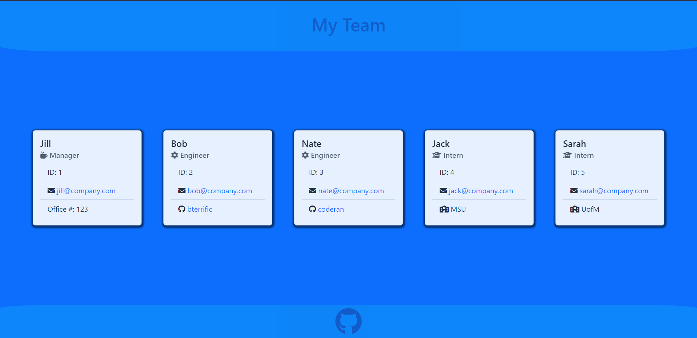

# Team Generator

## Description

This project uses inquirer and fs to both question the user and write a beautiful HTML page to show off your team.

## Table of Contents

- [Installation](#installation)
- [Usage](#usage)
- [License](#license)
- [Contributions](#contributions)
- [Tests](#tests)
- [Questions](#questions)

## Installation

Download it from my github, install dependencies with npm i, and run it with node index.js

## Usage

Video Tutorial: https://drive.google.com/file/d/1hfZzLEOZ3eksT65B_WOa_0CJEi8nTxxW/view?usp=sharing

Just follow the prompts and receive a beautiful HTML page displaying your team.

## License

This application is covered under the MIT license. Read more at [License: MIT](https://opensource.org/licenses/MIT)

## Contributions

Email me at sciclunajl@gmail.com with inquiries and ideas.

## Tests

By running the command npm test

## Questions

1. Where can I find your github so that I can view your other projects? https://github.com/scicluna

2. What email address should I use to contact you regarding further opportunities or questions? sciclunajl@gmail.com
